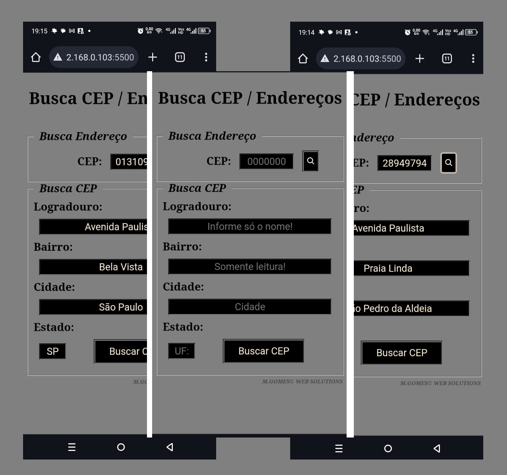

<h1 align="center"> BUSCA CEP </h1>

    Trata-se de um projeto destinado a estudos simples de utilização de API. 
    Onde em um ambiente de pesquisa pode ser fornecido: 
    * Um endereço através de um CEP informado 
    * Um CEP..., de um endereço

  <a href="#-tecnologias">Tecnologias</a>&nbsp;&nbsp;&nbsp;|&nbsp;&nbsp;&nbsp;
  <a href="#-projeto">Projeto</a>&nbsp;&nbsp;&nbsp;|&nbsp;&nbsp;&nbsp;
  <a href="#-layout">Layout</a>&nbsp;&nbsp;&nbsp;|&nbsp;&nbsp;&nbsp;
  <a href="#memo-licença">Licença</a>

  

 

  

## 🚀 Tecnologias

Esse projeto foi desenvolvido com as seguintes tecnologias:

- HTML e CSS
- JavaScript
- Git e Github
- API

## 💻 Projeto

    1° - através de input será tratada a as informações e retorno dos dados 
    2° - há um formulário para preenchimento de endereço: 
    .. se o usuário souber o CEP, bastará preenche-lo para retornar o endereço, faltando apenas complementos. 
    .. e se o usuário não souber, com o preenchimento do endereço, o cep será preenchido automaticamente.

    **EX URL API: 
    1° -> https://viacep.com.br/ws/28633470/json/  

    2° -> https://viacep.com.br/ws/rj/nova%20friburgo/natividade%20c%C3%A2ndida%20da%20silva/json

    No 1° exemplo basta informar a numeração do cep. 
    No 2° é informado, o UF, nome da cidade e nome da rua separados por '/'. 
    *Observado que dentro da URL o dados foram colocados com espaço manualmente, e foram manipulados para a correta informação

    ** Retorno da API: 

1° pesquisando endereço pelo CEP
    {
        "cep": "28633-470",
        "logradouro": "Rua Natividade Cândida da Silva",
        "complemento": "",
        "bairro": "Conselheiro Paulino",
        "localidade": "Nova Friburgo",
        "uf": "RJ",
        "ibge": "3303401",
        "gia": "",
        "ddd": "22",
        "siafi": "5867"
    }

2° pesquisando CEP pelo endereço 
    > aqui o conteudo vem dentro de um array(data[0].cep)
     [
        {
            "cep": "28633-470",
            "logradouro": "Rua Natividade Cândida da Silva",
            "complemento": "",
            "bairro": "Conselheiro Paulino",
            "localidade": "Nova Friburgo",
            "uf": "RJ",
            "ibge": "3303401",
            "gia": "",
            "ddd": "22",
            "siafi": "5867"
        }
    ]

[Visite o projeto online](https://celo-gomes.github.io/buscacep)

## 🔖 Layout

O Layout do projeto é de deselvolvimento próprio, usando de simplicidade, visando a mecânica e utilização. 

## :memo: Considerações

Esse projeto está sob a licença MIT. 

---

Feito com ♥ by M. Gomes :wave: [Visite-nos no Github](https://github.com/celo-gomes)
